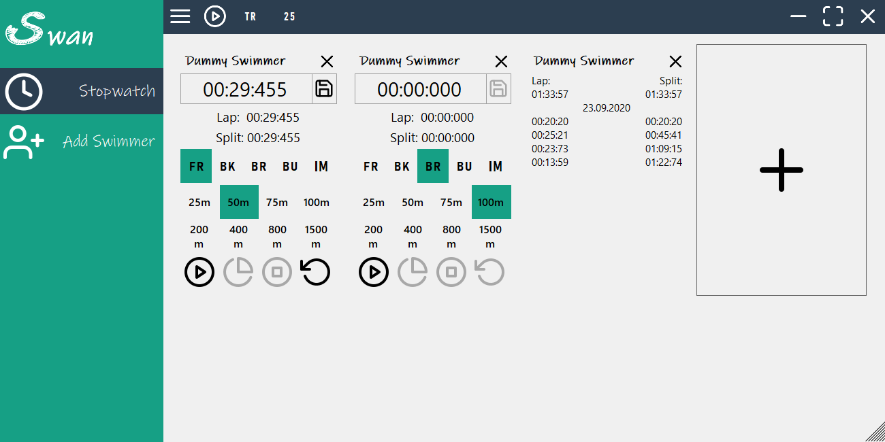

# Swan
> (Sw)im M(an)ager is created for swimming coaches to operate their daily tasks.
It is possible to record and track as many swimmers simultaneously as needed.

## Table of contents
* [Screenshots](#screenshots)
* [Technologies](#technologies)
* [Setup](#setup)
* [Features](#features)
* [Status](#status)
* [Contact](#contact)

## Screenshots

## Technologies
* SQLite Core 1.0.109.2

## Setup
Download the latest release, unzip it and start "Swan.exe".

## Features
List of features ready and TODOs for future development
* Save all of your swimmers personal data
* Stop and save tracks of as many swimmers simultaneously as needed
* Get a quick view of the last equal event through pressing the "Lap/Split" area in a Stopwatch Tile

To-do list:
* Extensive statistical features.

## Status
Project is: _in progress_.

## Contact
Created by [@ma-adrian] - feel free to contact me!